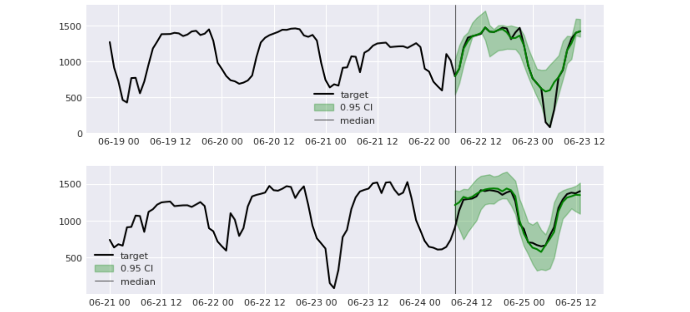

### Energy Time Series Prediction


### Problem Statement

**Given**: Hourly energy market data (production, import, export, price and other parameters) from European/Ural region of Russia, years 2018-2020.  
**The goal** is to predict price level for the next day ($y_{t+1}...y_{t+24}$).

Original and intermediate data is available upon request.

---

### Navigation

**Note**: it appears links below don't work on github. They do locally/in vscode

[`notebooks/ts-energy-intro.ipynb`](/notebooks/ts-energy-intro.ipynb): basic EDA and preprocessing (boring, skip)  
[`notebooks/ts-energy-main.ipynb`](/notebooks/ts-energy-main.ipynb): feature construction, training and troubleshooting 

---

### `ts-energy-intro`:

1. [Problem Statement](/notebooks/ts-energy-intro.ipynb#problem-statement)
2. [Data Wrangling](/notebooks/ts-energy-intro.ipynb#data-wrangling)
3. [Plots: A Few Smoothed Examples](/notebooks/ts-energy-intro.ipynb#plots-a-few-smoothed-examples)
4. [All Series Plot](/notebooks/ts-energy-intro.ipynb#all-series-plot)
5. [Yearly Zonal Plots](/notebooks/ts-energy-intro.ipynb#yearly-zonal-plots)
6. [Closer Look](/notebooks/ts-energy-intro.ipynb#closer-look)
7. [Seasonalities](/notebooks/ts-energy-intro.ipynb#seasonalities)
    * 7.1 [Periodogram View](/notebooks/ts-energy-intro.ipynb#periodograms)
    * 7.2 [ACF View](/notebooks/ts-energy-intro.ipynb#acf-view)
8. [Feature Variance](/notebooks/ts-energy-intro.ipynb#feature-variance)
9. [Complete Preprocessing](/notebooks/ts-energy-intro.ipynb#complete-preprocessing)

### `ts-energy-main`:  

1. [Preprocessing](/notebooks/ts-energy-main.ipynb#Preprocessing)
2. [Feature Construction](/notebooks/ts-energy-main.ipynb#Feature-Construction)
3. [Cross Validation Strategy](/notebooks/ts-energy-main.ipynb#Cross-Validation-Strategy)
4. [Training](/notebooks/ts-energy-main.ipynb#Training)
    * 4.1 [Multistep-ahead Prediction Strategy](/notebooks/ts-energy-main.ipynb#Multistep-ahead-Prediction-Strategy)
    * 4.2 [Training Procedure](/notebooks/ts-energy-main.ipynb#Training-Procedure)
    * 4.3 [CV Layout](/notebooks/ts-energy-main.ipynb#CV-Layout)
    * 4.4 [ParamGridIter](/notebooks/ts-energy-main.ipynb#ParamGridIter)
    * 4.5 [Start](/notebooks/ts-energy-main.ipynb#Start)
5. [Intermediate Results I](/notebooks/ts-energy-main.ipynb#Intermediate-Results-I)  
    * 5.1 [Training (Evaluation On)](/notebooks/ts-energy-main.ipynb#Training-(Evaluation-On))  
    * 5.2 [Loss Curves](/notebooks/ts-energy-main.ipynb#Loss-Curves)  
    * 5.3 [Possible Remedies](/notebooks/ts-energy-main.ipynb#Possible-Remedies)
6. [Intermediate Results II](/notebooks/ts-energy-main.ipynb#Intermediate-Results-II)
7. [Uncertainty](/notebooks/ts-energy-main.ipynb#Uncertainty)
8. [Prediction Plots](/notebooks/ts-energy-main.ipynb#Prediction-Plots)  
    * 8.1 [Predictions: Last (4th) Fold](/notebooks/ts-energy-main.ipynb#Predictions:-Last-(4th)-Fold)  
    * 8.2 [Predictions: 3rd Fold](/notebooks/ts-energy-main.ipynb#Predictions:-3rd-Fold)  
    * 8.3 [Predictions: 2nd Fold](/notebooks/ts-energy-main.ipynb#Predictions:-2nd-Fold)
    * 8.4 [Predictions: 1st Fold](/notebooks/ts-energy-main.ipynb#Predictions:-1st-Fold)
9. [Future Work](/notebooks/ts-energy-main.ipynb#Future-Work)

---

### Dependencies

I use a bunch of utils from https://github.com/forveg/utils.git@dev, which rely on standard tools: pandas, numpy, scikit-learn, matplotlib, lightgbm, tsfresh. I don't use neural architectures here, so nothing heavy like torch.
 
```
pip install git+https://github.com/forveg/utils.git@dev
```